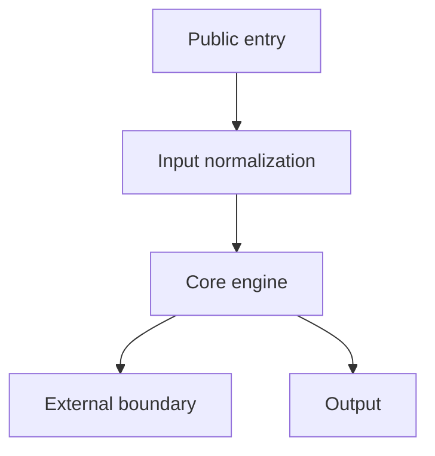
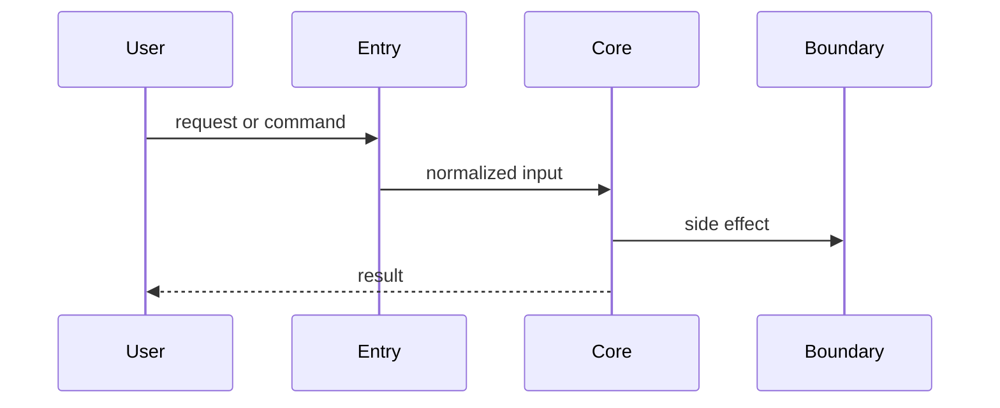
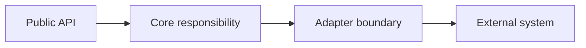

# Visual Reporting / 配图能力

Visuals are part of the analysis, not decoration. Use them when they reduce the
reader's mental load or reveal a boundary that prose would obscure.

配图是分析的一部分，不是装饰。只有当图能降低理解成本、展示边界或澄清流程时才画。

## Default Format / 默认格式

Use Mermaid by default because it is readable in markdown, easy to edit, and
keeps evidence close to the report text.

默认使用 Mermaid：可读、可编辑、能和源码证据放在同一份报告里。

Use other visuals only when Mermaid is not enough:

- Screenshot: UI behavior or rendered output matters.
- Generated bitmap: conceptual illustration requested by the user.
- Static image asset: the repository already contains a relevant diagram.

中文规则：

- UI 行为或渲染结果重要时，用截图。
- 用户明确需要概念图时，才考虑生成位图。
- 仓库已有架构图时，优先引用或解读已有图。

## Diagram Types / 图表类型

- Flowchart: command flow, data pipeline, compiler/parser stages, configuration
  precedence, state transitions.
- Sequence diagram: request lifecycle, job execution, agent/tool loop, cross
  service call.
- Component diagram: module ownership, plugin boundaries, adapters, external
  systems.
- State diagram: lifecycle-heavy systems, retry logic, workflow engines.
- Class/type diagram: only when type relationships are the architecture, not for
  routine object listings.

中文选择：

- 流程图：命令流、数据管道、编译/解析阶段、配置优先级、状态流转。
- 时序图：请求生命周期、任务执行、agent/tool 循环、跨服务调用。
- 组件图：模块所有权、插件边界、adapter、外部系统。
- 状态图：生命周期、重试、workflow engine。
- 类型图：只有类型关系就是架构重点时才画。

## Evidence Rules / 证据规则

Every diagram should be backed by nearby source references:

- Name the files or symbols that justify the nodes.
- Keep edge labels behavioral, not vague. Prefer "normalizes options" over
  "uses".
- Do not draw dependencies that were not observed in code or docs.
- If an arrow is inferred, say it is inferred.
- After each important diagram, include a short "code reading" paragraph that
  maps the diagram back to files or symbols.

中文证据规则：

- 图里的节点要能对应到文件、符号或文档。
- 边的文字描述行为，不写空泛的“调用”“使用”。
- 没在代码或文档中看到的依赖不要画。
- 推断出来的箭头要标注为推断。
- 每张重要图后面要有一小段“代码解读”，把图重新落回源码文件或符号。

## Size Discipline / 尺寸纪律

- Prefer 5-9 nodes for a runtime diagram.
- Split diagrams when one picture needs more than 12 nodes.
- Put the most important diagram near the first architecture explanation.
- A deep report usually needs 2-4 diagrams; a normal report usually needs 0-2.

中文尺寸：

- 运行图优先控制在 5-9 个节点。
- 超过 12 个节点就拆图。
- 最重要的图放在第一次解释架构的位置附近。
- 深度报告通常 2-4 张图；标准报告通常 0-2 张。

## Mermaid Patterns / Mermaid 模式

Runtime flow:

Request sequence:

Component boundary:

Adapt labels to the project. Do not copy these examples unchanged into a final
report.

最终报告要根据项目改写节点和边，不要原样复制这些示例。
